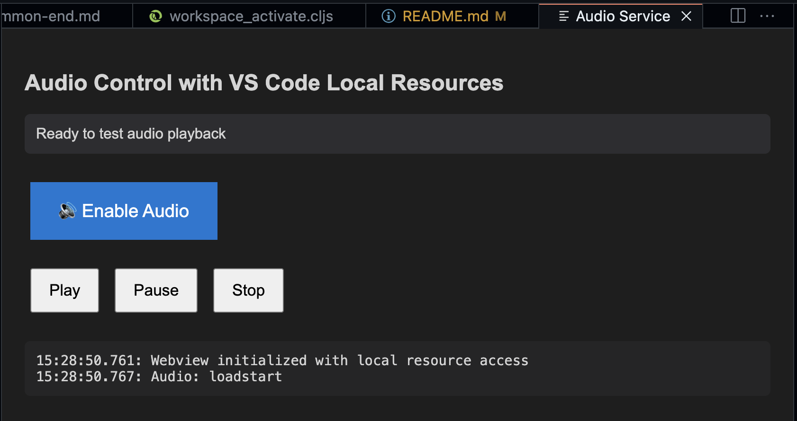

# Joyride + LM Tools for CoPilot

*Presenting Joyride with an AI powered presentation system, made with Joyride*

A complete AI-powered presentation system built entirely with [Joyride](https://github.com/BetterThanTomorrow/joyride) - user space scripting for VS Code. The system enables AI-assisted slide creation, narration generation, text-to-speech conversion, and interactive presentation delivery, all within the VS Code environment.

**Taking this for a spin is as easy as opening this project in VS Code with CoPilot enabled**, and installing the Joyride extension. (But please read on a bit before you do this.)

The audio generation features need an OpenAI API key. But you and CoPilot can hack it to use something else for audio generation, because ...

... This project is **100% Joyride** - Leveraging VS Code's extension API.

It is also very WIP, and meant to forever be WIP, but your WIP. 😀

## Quick Start

### Core Requirements

1. **[GitHub Copilot](https://marketplace.visualstudio.com/items?itemName=GitHub.copilot)**
2. **[Joyride](https://marketplace.visualstudio.com/items?itemName=betterthantomorrow.joyride)** - User space scripting for VS Code
3. (for text-to-speech generation) **OpenAI API Key in your env**:
   ```bash
   export OPENAI_API_KEY="your-openai-api-key"
   ```

### Running the System

When you open the project with Joyride installed, the slide navigation system will automatically activate and the **Audio Service** webview will open.



For audio to be played, yuu will need to click the **Enable Audio** button (browser restriction requiring a user gesture to autoplay audio).

See that button in the stats bar with “🎭”? It's a system prompt/mood selector. Select the **presenter** mood. Then ask CoPilot to show the first slide.

With your OpenAI API key set in the environment you can then activate the **audio-generator** mood, and ask Copilot to generate audio for the first slide. Then switch back to **presenter** mode and ask CoPilot to present the slide.

To navigate the slides yourelf, with the keyboard or a clicker, you'll need to set up some keyboard shortcuts. See the slide navigation script
[archive/next_slide.cljs](archive/next_slide.cljs), which starts with a bunch of shortcuts you can use in your keybindings.json file. (Use the **Toggle Line Comment** command to get JSON you can copy.)

## Core Features

### AI Workflow support

The project comes with CoPilot Instructions/moods supporting both VS Code hacking and presentation authoring/presenting.

Easily switch between different system prompts depending on where in the workflow you are using the **AI mood** status bar button . Available system prompts (in `prompts/system/`):

#### Slideshow creation moods and workflow/pipeline

Creating slides is a composition of human direction, AI agentic processing and Joyride scripts. The main pipeline looks something like so

```
Human has a story to share
     ↓
🤝 Human + **slide-author** → Draft slides & notes
     ↓ (human feedback & iteration)
📖 **story-author** → Retrofits with storytelling expertise
     ↓ (human feedback & story refinement)
🎙️ **slide-narration-author** → Crafts narration scripts
     ↓ (human feedback & narration polish)
🔊 **audio-generator** → Generates high-quality voice audio
     ↓ (human feedback & audio refinement)
✨ **presenter** (+ human) → Present slides
       (the human needs to ask for next slides)
```

It is the human who is responsible for the main orchestration. Including during presentation. A possible improvement you can try to vibe code is to make the AI able to run the whole presentation from start to finish.

The reason for the story authoring step is so that slide narration is grounded in the overall story and can avoid some of the repetition that AI is so happy to produce.

#### Coding moods

- **architect** - For system design and architectural decisions
- **joyride-hacker** - For interactive programming and VS Code hacking with Joyride
- **reviewer** - Review Joyride code to get suggestions for improvements for code quality and maintainability.

## Project Structure

```
├── slides/                            # Markdown presentation slides
│   ├── *.md                           # Individual slides with HTML/CSS
│   ├── *-notes.md                     # Presentation guidance for each slide
│   ├── voice/                         # Generated audio files
│   ├── images/                        # Slide images and assets
│   ├── narration-script/              # Detailed narration scripts
│   └── opening-sequence/              # Presentation introduction assets
├── .joyride/
│   ├── src/
│   │   ├── next_slide.cljs            # Slide navigation engine
│   │   ├── next_slide_notes.cljs      # Slide notes management
│   │   ├── showtime.cljs              # Status bar timer/stopwatch
│   │   ├── ai_mood_selector.cljs      # AI system prompt switcher
│   │   └── ai_presenter/              # AI presentation components
│   │       ├── audio_generation.cljs  # TTS integration
│   │       ├── audio_playback.cljs    # WebView audio player
│   │       └── opening_sequence.cljs  # Presentation introduction
│   ├── resources/
│   │   └── audio-service.html         # Audio playback webview
│   └── temp-audio/                    # Temporary storage for generated audio
├── prompts/                           # AI system prompts
│   ├── system/                        # Different AI personality modes
│   │   ├── presenter-instructions.md              # Main presentation mode
│   │   ├── joyride-hacker-instructions.md         # Developer mode
│   │   ├── architect-instructions.md              # System design discussions
│   │   ├── slide-author-instructions.md           # Content creation mode
│   │   ├── slide-narration-author-instructions.md # Script creation
│   │   ├── story-author-instructions.md           # Narrative development
│   │   ├── audio-generator-instructions.md        # Voice synthesis
│   │   └── reviewer-instructions.md               # Code review mode
│   └── system-common-*.md                         # Shared prompt components
├── docs/
│   ├── PROJECT_SUMMARY.md             # Technical overview for LLMs
│   ├── images/                        # Documentation images
│   └── log/                           # Development logs
├── audio/                             # Audio assets
├── slides.edn                         # Slide configuration and ordering
├── deps.edn                           # Clojure classpath (for tooling)
├── package.json                       # Node.js dependencies
└── next-slide.css                     # Slide styling
```

## Example Usage

### Basic Presentation
```clojure
;; 1. Hide the chat during presentation
(vscode/commands.executeCommand "workbench.action.closeAuxiliaryBar")

;; 2. Show a specific slide
(next-slide/show-slide-by-name!+ "hello.md")

;; 3. Generate and play audio for the slide
(p/let [gen-result (ai-presenter.audio-generation/generate-slide-audio!+
                    "hello" ; slide name (without .md)
                    "Your engaging presentation script here...")]
  (ai-presenter.audio-playback/load-and-play-audio!+ "slides/voice/hello.mp3"))

;; 4. Answer questions during presentation
(ai-presenter.audio-generation/generate-and-play-message!+
 "That's a great question! Here's my answer...")

;; 5. Navigate to next slide when ready
(next-slide/next! true)
```

### AI-Assisted Presentation

Ask Copilot (with LM Tools enabled):
> "Present the slide about the LM tools for Joyride, please. I'm especially interested in vibe coding"

The AI will:
1. Navigate to the slide
2. Read slide content and notes
3. Generate a narration script, incorporating your focus
4. Create audio narration
5. Play the audio
6. Wait for your next instruction

(Actually, the AI is instructed such that in this case it *should* do the authoring and generation steps. But most often it just plays whatever audio is already generated for the slide. Prompting skill issue, I think.)

## 🚀 Extension Ideas

- **Multiple Voices** - Different narrators for different slide types
- **Interactive Elements** - Audience participation through VS Code commands

## 📖 Learning Resources

- [Joyride Documentation](https://github.com/BetterThanTomorrow/joyride)
- [Interactive Programming with Clojure](https://clojure.org/guides/repl/introduction)
- [VS Code Extension API](https://code.visualstudio.com/api)

## Contributing

This project demonstrates Interactive Programming principles built entirely in **Joyride ClojureScript**.

### For Effective Development

For the most productive experience, both the human and the artificial intelligence should be connected to the Joyride REPL:

**Human setup:**

- Install [Calva](https://marketplace.visualstudio.com/items?itemName=betterthantomorrow.calva) a Clojure extension
- Command: **Calva: Start Joyride REPL and Connect**

See [calva.io](https://calva.io) for how to use Calva.

**AI setup:**

- With Joyride installed, there is no AI setup.

### Development Workflow
1. Joyride automatically gives
1. Start the Joyride REPL
1. Experiment with functions interactively, together with CoPilot
1. Build upon the existing system
1. Share your enhancements

**Both intelligences working together in the same REPL = Interactive Programming magic!** ✨

**Happy Interactive Programming!** 🎉

## License 🍻🗽

[MIT](LICENSE.txt)

## Sponsor my open source work ♥️

You are welcome to show me that you like my work:

* https://github.com/sponsors/PEZ
