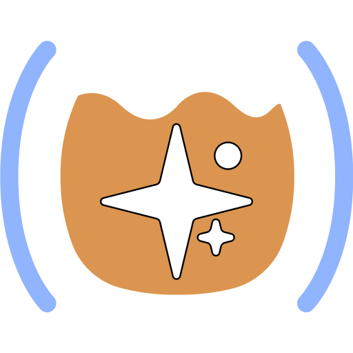

# Topics

Can we turn CoPilot into an Interactive Programmer?

## Backseat Driver

- What is it, and why?
- The provided tools
- Demo
- Do we dare? (YOLO mode)
- Experience so far (skill issues)
- Well, can we?
- WIP, where next?
- MCP

